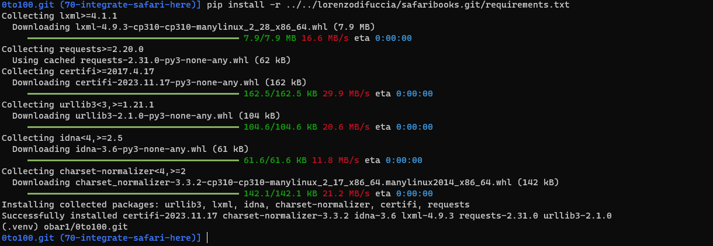

# readme

| SQ                                                                                                                                                    | CI                                                                            | CodeSpace                                                                                                                 |
| ----------------------------------------------------------------------------------------------------------------------------------------------------- | ----------------------------------------------------------------------------- | ------------------------------------------------------------------------------------------------------------------------- |
| [](https://sonarcloud.io/summary/new_code?id=obar1_0to100) |  | [](https://codespaces.new/obar1/0to100?quickstart=1) |

## oto100

0 to 100 ... learn anything from webresources (and not)

### 1st time usage:

```bash
# env
python -m venv .venv
. .venv/bin/activate
pip install -r requirements.txt

# copy sample yaml conf
cp ./zero_to_one_hundred/tests/resources/map.yaml .
cat map.yaml
```


```bash
# tip:  add it to .bash_rc etc or some shell script
export MAP_YAML_PATH=$(pwd)/map.yaml
python ./main.py help

```


### daily usage:

- create new section

```bash
export MAP_YAML_PATH='map.yaml'

url=https://cloud.google.com/docs
python ./main.py create_section $url

url=https://cloud.google.com/help
python ./main.py create_section $url
#...etc
```


## oto100 safari books :construction:

0 to 100 ... learn anything from safari books https://learning.oreilly.com/member/login/

### 0th time usage:

https://github.com/lorenzodifuccia/safaribooks

> just a sample
> 

### 1st time usage:

```bash
# env
python -m venv .venv
. .venv/bin/activate
pip install -r requirements.txt

# copy sample yaml conf
cp ./zero_to_one_hundred/tests_sb/resources/map.yaml .
cat map.yaml

```


```bash
vim map.yaml
# add your membership details :)

export MAP_YAML_PATH='map.yaml' && python ./main_sb.py help

# tip:  add it to .bash_rc etc or some shell script
```


### daily usage:

- create new meta book

```bash
export MAP_YAML_PATH='map.yaml'

url=https://learning.oreilly.com/library/view/hunt-the-pragmatic-programmer/020161622X/
python ./main_sb.py create_meta_book $url


```

> add your membership details :) and it will work


> ex with mine :)


and you have a `toc.md` for free to use as index


