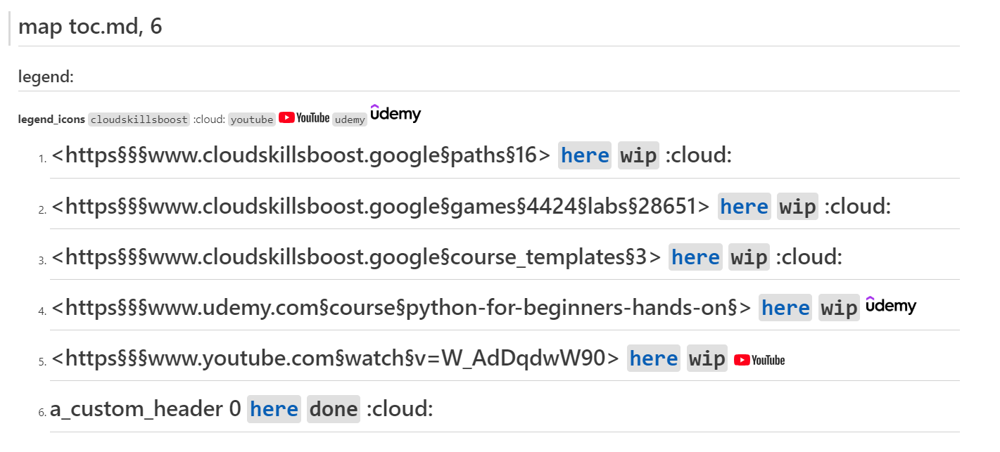
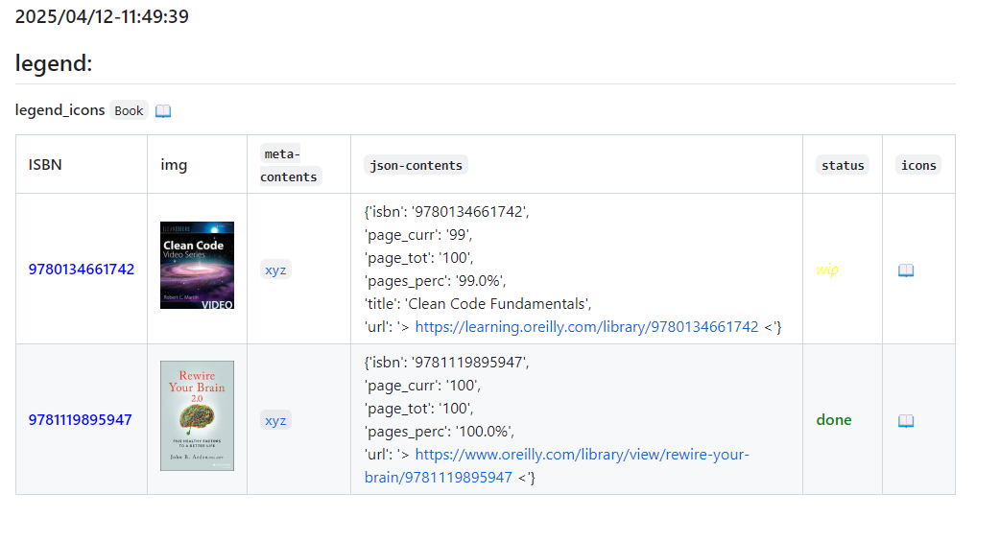

# readme

| SQ | CI |                                                                                                         
| -- | -- | 
| [](https://sonarcloud.io/summary/new_code?id=obar1_0to100) | [](https://github.com/obar1/0to100/actions/workflows/makefile.yml) | 

We read training material from the web and learn from it by doing, but how do we keep that a bit organized? I came up with an idea: this small tool.
Given a 'url', it creates the entry in a markdown map and a folder and links them; in this way, you can easily jump between different sections inside your preferred ide. As you expand the map with new contents, you build some reference material, keep it local all the time, and searchable all the time on your daily coding and use it to fee your local `llm` :).

## quick demo

> in you want to check this quickly ...

[](https://codespaces.new/obar1/0to100?quickstart=1)

just open this repo in your GitHub Codespace and run the demo as:

```bash
bash demo.sh zo
``` 



[here](./toc_zo.md)

```bash
bash demo.sh sb
```



[here](./toc_sb.md)


## simple local setup:

```sh
make setup

cp ./tests/tests_zo/resources/map.yaml map_zo.yaml
cp ./tests/tests_sb/resources/map.yaml map_sb.yaml
# edit them (optionally)
```

## daily usage

```sh
uv run ./main.py help

export MAP_YAML_PATH=map_zo.yaml && uv run ./main.py zo help

export MAP_YAML_PATH=map_sb.yaml && uv run ./main.py sb help
```
> check more usage samples in [demo](./demo.sh)


