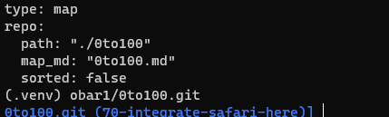
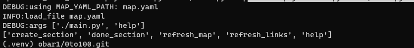
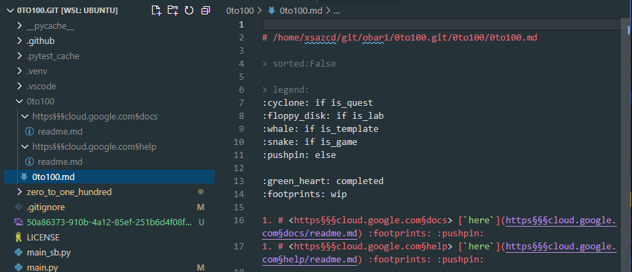
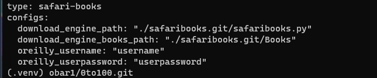
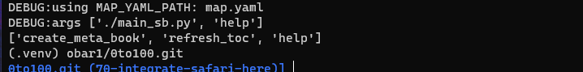
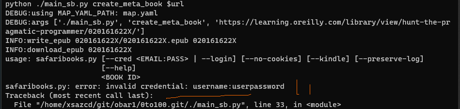
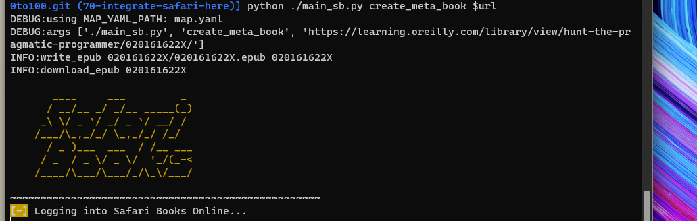

# readme

| SQ                                                                                                                                                    | CI                                                                            | CodeSpace                                                                                                                 |
| ----------------------------------------------------------------------------------------------------------------------------------------------------- | ----------------------------------------------------------------------------- | ------------------------------------------------------------------------------------------------------------------------- |
| [](https://sonarcloud.io/summary/new_code?id=obar1_0to100) | [](https://github.com/obar1/0to100/actions/workflows/makefile.yml) | [](https://codespaces.new/obar1/0to100?quickstart=1) |

## oto100

0 to 100 ... learn anything from webresources (and not)

in a nutshell: you read training material from the web and learn from it by doing.
Given a `url` it creates the entry in a markdown **map** and link that to it, in this way you can easily jump between different sections inside your ide of preference; as you expand the map with new contents you build some reference material you keep it local all the time and you can search on

current commands:
help:
['create_section', 'done_section', 'refresh_map', 'refresh_links', 'help']

### 1st time usage:

```bash
# env
python -m venv .venv
. .venv/bin/activate
pip install -r requirements.txt

# copy sample yaml conf
cp ./zero_to_one_hundred/tests/resources/map.yaml .
cat map.yaml
export MAP_YAML_PATH=$(pwd)/map.yaml
# tip:  add it to .bash_rc etc or some shell script

```



```bash
chmod +x *.py
./main.py help
```



### daily usage:

- create new section

```bash
url=https://cloud.google.com/docs
./main.py create_section $url

url=https://cloud.google.com/help
./main.py create_section $url
#...etc
```



## oto100 safari books :construction:

0 to 100 ... learn anything from safari books https://learning.oreilly.com/member/login/

in a nutshell: you read training material from the oreilly and learn from it by doing.
Given a `url` it creates the entry in a markdown **map** and link that to it, in this way you can easily jump between different sections inside your ide of preference; as you expand the map with new contents you build some reference material you keep it local all the time and you can search on

current commands:

help:
['create_meta_book', 'refresh_toc', 'help']

### 0th time usage:

> use what you prefer to  grab epub/pdf from oreilly 
https://github.com/lorenzodifuccia/safaribooks


> you can even save pages as you go with 
https://chromewebstore.google.com/detail/reader-view/ecabifbgmdmgdllomnfinbmaellmclnh


### 1st time usage:

```bash
# env
python -m venv .venv
. .venv/bin/activate
pip install -r requirements.txt

# copy sample yaml conf
cp ./zero_to_one_hundred/tests_sb/resources/map.yaml .
cat map.yaml
export MAP_YAML_PATH=$(pwd)/map.yaml
# tip:  add it to .bash_rc etc or some shell script
```



```bash
vim map.yaml
# add your membership details :)
```

```bash
chmod +x *.py
./main_sb.py help
```



### daily usage:

- create new meta book

```bash
url=https://learning.oreilly.com/library/view/hunt-the-pragmatic-programmer/020161622X/
./main_sb.py create_meta_book $url
```

> add your membership details :) and it will work



> ex with mine :)



and you have a `toc.md` for free to use as index


