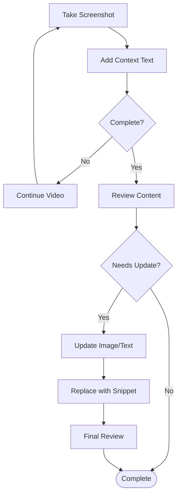

# readme

| SQ | CI |                                                                                                         
| -- | -- | 
| [](https://sonarcloud.io/summary/new_code?id=obar1_0to100) | [](https://github.com/obar1/0to100/actions/workflows/makefile.yml) | 

We read training material from the web and learn from it by doing, but how do we keep that a bit organized? I came up with an idea: this small tool.
Given a 'url', it creates the entry in a markdown map and a folder and links them; in this way, you can easily jump between different sections inside your preferred ide. As you expand the map with new contents, you build some reference material, keep it local all the time, and searchable all the time on your daily coding and use it to fee your local `llm` :).

## quick demo

> in you want to check this quickly ...

[](https://codespaces.new/obar1/0to100?quickstart=1)

just open this repo in your GitHub Codespace and run the demo as:

```bash
bash demo.sh zo
``` 


[here](./toc_zo.md)

```bash
bash demo.sh sb
```


[here](./toc_sb.md)


### oto100

0 to 100 ... learn anything from the web 

commands:

```sh
# create_section = create a new section
section=https://www.cloudskillsboost.google/paths/16
./main.py zo create_section "$section"

# done_section = tag a section as done, so in the map it will visible
section=https://www.cloudskillsboost.google/paths/16
./main.py zo done_section "$section"

# refresh_map = refresh the section map
./main.py zo refresh_map

# refresh_section_contents = refresh links to sections in the readme.md(s) and delete orphaned image(s)
./main.py zo refresh_section_contents
```
#### create_section
in `create_section` you can override the default toc title adding another `#` hint below the one header created automatically in the section folder
ex
```markdown
# <https§§§www.cloudskillsboost.google§catalog>
> <https://www.cloudskillsboost.google/catalog>

# catalog for the gcloud products
```
the text `catalog for the gcloud products` will be shown in the toc

in `create_section` if a youtube url is used the section created looks a bit more custom than the general one
ex


> this might not work if you run the demo in a github codespace, but it will works locally

#### refresh_section_contents
in `refresh_section_contents` you can expand links from other sections automatically 
ex
```markdown
# <https§§§www.cloudskillsboost.google§catalog>
> <https://www.cloudskillsboost.google/catalog>

https://www.cloudskillsboost.google/doc
```
expand the last link to point to the section for the doc - handy as anchor technique 

in `refresh_section_contents` img in the folder that have no reference in md readme anymore will be deleted




### oto100 (safari) books

0 to 100 ... learn anything from safari books https://learning.oreilly.com/member/login/

same as above but it can use some external lib to grab epub from oreilly

current commands:

```sh
# snatch_book = snatch a book from safari
./main.py sb snatch_book https://learning.oreilly.com/library/view/rewire-your-brain/9781119895947

# refresh_toc = refresh the toc with al the books info
./main.py sb refresh_toc
```


## simple local setup:

```sh
make setup

cp ./zero_to_one_hundred/tests/tests_zo/resources/map.yaml map_zo.yaml
cp ./zero_to_one_hundred/tests/tests_sb/resources/map.yaml map_sb.yaml
# edit them
code .
chmod +x main.py
```

## daily usage

```sh
. venv/bin/activate
export MAP_YAML_PATH=map_zo.yaml && ./main.py zo help
# or depending what you want to do
export MAP_YAML_PATH=map_sb.yaml && ./main.py sb help
```
> check more usage samples in [demo](./demo.sh)