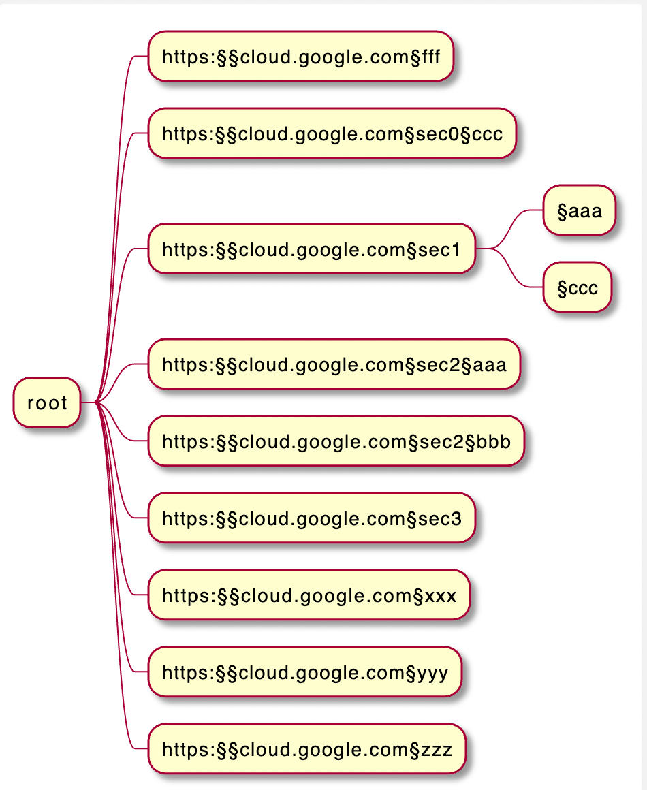

# 0to100

> 0 to 100 to learn anything


## Setup

* install xpdf
```
brew install xpdf
```

* install vscode
```
brew install --cask visual-studio-code
```


* chrome extension to save pages in pdf
save the page with https://chrome.google.com/webstore/detail/print-friendly-pdf/ohlencieiipommannpdfcmfdpjjmeolj/related or https://chrome.google.com/webstore/detail/htmlurl-to-pdf-with-pdfma/dlmgniacaacmbccdegkadebbaphkonpb

## Usage

### using the py scripts

## 1-time (manual) setup 

> example for tag 0.1 

latest at https://github.com/obar1/0to100/tags


```bash
TAG_0to100='0.x' 
ZEROto100='0to100'
ZEROto100_HOME="/Users/obar1/git/https-cloud.google.com.com.git" 

cd "$ZEROto100_HOME" && mkdir $ZEROto100 && cd $ZEROto100
# get code and unpack it

wget https://raw.githubusercontent.com/obar1/0to100/main/zero_to_one_hundred/tests/resources/repo/map.yaml

wget -qO- https://github.com/obar1/${ZEROto100}/archive/refs/tags/${TAG_0to100}.tar.gz | tar -xvf -
mv "${ZEROto100}-${TAG_0to100}" latest
```

## daily usage

- vars
  
> unless you have a lot of them just add in the `.bashrc/.zshrc`

```bash
# 0to100 setup

export ZEROto100='0to100'
export ZEROto100_HOME="/Users/obar1/git/https-cloud.google.com.com.git" 
export h0200="$ZEROto100_HOME/$ZEROto100"

export CONFIG_FILE="$h0200/map.yaml"
export ZEROto100py="$h0200/latest/zero_to_one_hundred/main.py"

function create_section() {
  python $ZEROto100py create_section $1
}
function refresh_sections() {
  python $ZEROto100py refresh_sections
}
function refresh_links() {
  python $ZEROto100py refresh_links 
}
function refresh_puml() {
  python $ZEROto100py refresh_puml
}
```
-  create new section

```bash
create_section https://cloud.google.com/docs
```
-  refresh sections

```bash
refresh_sections 
```
-  refresh links

```bash
refresh_links 
```
-  refresh puml

```bash
refresh_puml
```



### using the bash bash scripts

*OBSOLETE.....................*

* init the scripts in cmd line

```bash
(py37) √ 0to100.git % source ./_tools/runme.sh

```

* **use it to learn**

> we want to 1 level hierarchy and avoid the deep levels of the pages

- go to the https://cloud.google.com/

- get a section/link

```
ex
https://cloud.google.com/docs
```

- create local folder and some placeholder for the section/link automatically using the tools scripts

```bash
(py38) √ 0to100.git % do_section https://cloud.google.com/docs
https://cloud.google.com/docs
https:§§cloud.google.com§docs
https://cloud.google.com/docs
https:§§cloud.google.com§docs
# map
## wip
> flatview

1. <https://cloud.google.com/docs> :ok: [`here`](../https:§§cloud.google.com§api-gateway§docs/readme.md)1. <https://cloud.google.com/docs> :o: [`here`](../https:§§cloud.google.com§docs/readme.md)
1. <https://cloud.google.com/docs> :o: [`here`](../https:§§cloud.google.com§docs/readme.md)
https://cloud.google.com/docs
https:§§cloud.google.com§docs
copy pdf...
```
- go to the page https://cloud.google.com/docs and export as pdf in the folder created automatically

- hit a key

- the pdf is renamed and txt exported and vscode is called


- `map.md` has automatically the section links to the local files and original link added


1. goto back ;) ... and expand your knowledge :*


## Development

### Installation

* Install Poetry: <https://python-poetry.org/docs/#installation>
* Install python env: `pyenv install 3.7.0`
* Install virtual env: `pyenv virtualenv 3.7.0 pip_mse_ingestion`
* Activate virtual env: `pyenv activate pip_mse_ingestion`
* Install package and dependencies: `poetry install`
* Install pre-commit hooks: `poetry run pre-commit install`

### Run pre-commit hooks manually

All pre-commit hooks will be run automatically when pushing changes.
They can also be run on staged files or on all files manually:

```bash
# Run all hooks against currently staged files,
# this is what pre-commit runs by default when committing:
pre-commit run

# Run all the hooks against all the files:
pre-commit run --all-files

# Run a specific hook against all staged files:
pre-commit run black
pre-commit run flake8
pre-commit run isort
pre-commit run pylint
```


```